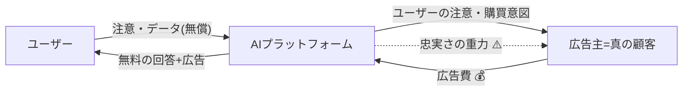

# 広告の次は何か — AI収益モデルの構造論

> ChatGPTへの広告導入(2026年9月、Amazon DSP経由のパイロット開始)をきっかけに、「生成AIは広告以外でどう稼ぎうるか」を構造から考えたメモ。

🐰図はこっち: <https://stakiran.github.io/html/ai_monetization_models.html>

## 1. 前提: なぜOpenAIは広告に踏み切ったのか

出発点は「広告は愚行では?」という素朴な疑問だった。体験は確実に劣化するし、信頼して相談する相手の回答に広告が混ざる裏切られ感は、検索結果のそれとは質が違う。

しかしOpenAI側の構造を見ると、やらざるを得ない合理性がある。

- ChatGPTの無料ユーザーは数億人規模。検索と違い、**1クエリごとにGPU推論の実費がかかる**ため、「使われるほど赤字が膨らむ無料サービス」という過去にほぼ例のない構造になっている
- 有料転換率は数%にとどまり、サブスク・API収入ではデータセンターへの巨額コミットを埋められない
- 無料ユーザーを収益化する「実績のある」手段は、歴史上ほぼ広告しかない(Google、Meta、テレビ)

つまり広告は「思いつく唯一の策」ではなく、**サブスク・API・コマース・デバイス等を全部やった上で、それでも足りないから足した「つなぎ資金」**である。

## 2. 広告モデルの解剖: 実質はB2Bである

広告は三者構造だ。ユーザーは無料で使い、対価として「注意」と「購買意図データ」をプラットフォームに渡す。プラットフォームはそれを束ねて広告主に売る。**お金の流れだけ見れば、売り手=プラットフォーム、買い手=企業の純然たるB2B取引**であり、売られている商品はユーザー自身である。

通常のB2Bとの決定的な違いは、**金を払う人とサービスの受益者が別人で、利害が時々対立する**こと。ユーザーは最適な答えが欲しく、広告主は自社製品を選ばせたい。収益を伸ばそうとするほどプラットフォームは支払者側に引かれる——SNSのエンゲージメント最適化批判は、この重力の帰結だった。

## 3. 「払う人≠使う人」は広告だけではない

この構造は経済のあちこちにある(プリンシパル=エージェント問題)。

| 例 | 払う人 | 使う人 | 健全性 |
|---|---|---|---|
| 子供の教育 | 親 | 子 | ○(愛情で利害が概ね一致) |
| 企業向け業務ソフト | 経営・情シス | 現場社員 | △(使いにくい社内システムの温床) |
| 転職エージェント | 採用企業 | 求職者 | △(企業側に引力) |
| 格付け機関(issuer-pays) | 格付けされる発行体 | 投資家 | ×(サブプライム危機の温床) |
| 無料テレビ | スポンサー | 視聴者 | △(視聴率最適化) |

並べると法則が見える。**払う人と使う人の利害が一致していれば健全に回り、対立し監視も効かなければ腐敗する。** 広告モデルの健全性は「プラットフォームがどちらに忠実か」を監視できるかで決まる。

## 4. 設計原理: 忠実義務を収益構造に埋め込む

以上から、次世代モデルの設計原則が導ける。

> **AIが忠実であるべき相手(ユーザー)と、AIに利益をもたらす主体を、構造的に一致させること。**

金融業界は同じ進化を一度たどっている。販売会社からキックバックを得て商品を薦める証券営業(=広告と同型)への反省から、顧客からだけ報酬を受け取り顧客利益への忠実義務を負う助言者(フィデューシャリー・デューティー)が生まれた。AIはいまこの分岐点の手前に立っている。

## 5. 候補モデルの棚卸し

### 5-1. 成果分配(AIの成功報酬化)

弁護士の成功報酬と同型。前払いゼロで使い始め、AIがユーザーのために価値を生んだ時だけ(保険料の節約、収入増、案件獲得)、その一部を事後に受け取る。

- 払う人=受益者、かつ支払いは成果からのみ → **利害一致が構造に埋め込まれる**
- 無料ユーザーは「負債」から「未実現の成功報酬の在庫」に変わる
- ソフトウェア市場(年間数千億ドル)ではなく**人件費市場(数十兆ドル)**への値付けが可能になる
- 弱点: 結局ユーザーの財布から出る。成果の計測も難しい

### 5-2. 中立化した取引手数料(エージェント型コマース)

AIがユーザーの代理で購買し、**どの売り手からも一律料率**の手数料を取る。料率が一律なら、AIはどれを薦めても収益が同じになり、推薦を歪める動機が構造的に消える(クレジットカードの加盟店手数料と同型)。ユーザーは一切払わない。

広告との違いは一点だけ: 広告主は「ユーザーが得しようが損しようが」儲かるが、手数料は「取引が成立=ユーザーの意図が満たされた時」しか発生しない。**成否は料率の中立性設計に懸かっている。**

### 5-3. 利害連動スポンサー ★個人的本命

「ユーザーが得をした時に限って得をする第三者」に払わせる。

- **保険者**: 健保組合が加入者に健康AIを無料配布 — 加入者が健康になるほど保険者の支払いが減る
- **雇用主**: 従業員に業務AIを — 生産性向上で回収
- **銀行**: 顧客に家計AIを — 顧客の破産は銀行の損
- **政府・自治体**: 住民にAIを — 図書館・義務教育と同じ公共財の理屈(ソブリンAIはその萌芽)

第三者の利益関数がユーザーの厚生と**正の相関**を持つよう選ばれているため、広告の「忠実さの重力」が原理的に発生しない。保険・雇用主・政府はすでに「人間の厚生に金を払う予算」(医療費・研修費・教育費)を持っており、AIはその費目の置き換えとして売れる——立ち上がりが最も早いと予想する。

急所は、スポンサーとユーザーの利害が「おおむね」一致でも「完全に」ではないこと(雇用主提供のAIは従業員の転職相談に乗れるか?)。**契約でAIの忠実義務をユーザー側に固定できるか**が成否を分ける。Microsoft×AFT(全米教員連盟)の「生徒データを学習に使わない」法的拘束力ある協定(2026年9月)は、まさにその先例である。

### 5-4. その他の族

- **賑わいモデル**: 無料ユーザーは金の代わりに「市場の厚み」で貢献し、そこに参加したい事業者が出店料を払う(F2Pゲーム、ショッピングモールのテナント料と同型)
- **ユーザー起点の逆オークション**: ユーザーが「掃除機が欲しい、提案せよ」と宣言した時だけ売り手が回答権に課金される。注意を盗む広告ではなく、招かれた者だけが払う
- **B2B利益による内部補助**: 企業向けで稼ぎ個人向け無料枠を養う(Anthropicが現にやっている形)

## 6. 結論

1. 広告の病巣は技術ではなく構造——「ユーザーの成功と無関係に儲かる第三者」を招き入れたこと
2. 次世代モデルとは新しい課金技術ではなく、**AIの忠実義務を収益構造そのものに埋め込むこと**
3. 「無料ユーザーが一切払わない」を制約条件にすると、解は「**ユーザーの成功から利益を得る第三者に、一律条件で払わせる**」族に収束する(中立手数料・利害連動スポンサー・公共財)
4. 広告はそこへ至るまでの過渡期の資金繰りであり、最終的に勝つのは「**ユーザーが儲かった時だけ儲かるAI**」——利害の一致を製品仕様にした会社だろう

---
*2026-09-11 / ChatGPT×Amazon DSP広告パイロット報道を起点にした議論の整理*