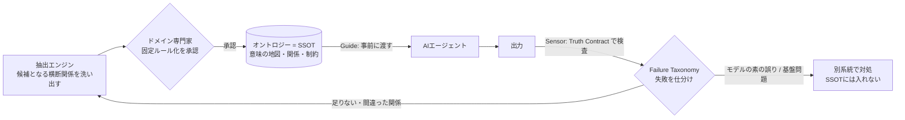

# Harness as Ontology — 用語集を「生きた SSOT」として保つ設計

> Thoughtworks の記事 [_Harnessing agent semantic reliability at scale_](https://www.thoughtworks.com/insights/blog/technology-strategy/harnessing-agent-semantic-reliability-at-scale) を、「オントロジー（用語と概念の意味・関係の体系）を作って渡し、足りない・間違いがあれば直し続けることで、常に SSOT（Single Source of Truth）な用語集を維持する」という観点から整理したメモ。

## 要旨（TL;DR）

AI エージェントを複数の業務ドメインにまたがって動かすと、**同じ言葉が部署ごとに違う意味を持つ**ために、「事実としては正しいが文脈がズレた答え」を自信たっぷりに返す事故が起きる。これを防ぐ鍵は、賢いモデルを選ぶことでも、プロンプトを工夫することでもなく、**オントロジーを SSOT として作り、本番の失敗を差し戻して更新し続ける仕組み（harness）**を回すこと。ポイントは、用語集の維持を「ドキュメント運用の心がけ」から**制御系（フィードフォワード＋フィードバック）の問題**へ置き換える点にある。

---

## 1. オントロジーは「辞書」ではない

まず前提の整理。ここでいうオントロジーは、`用語 → 定義` を並べた glossary（用語集）**ではない**。本体は、

- 概念どうしの **関係** と **制約** のグラフ
- 例：「ある約束（commitment）は、その下にある制約（constraint）を尊重しなければならない」

といった、**ベテランだけが暗黙に知っている“関係”を明示ルール化したもの**である。辞書は語の意味を並べるが、オントロジーは意味の**つながり方**を規定する。エージェントに効くのは後者。

## 2. 敵は semantic flattening（意味の平坦化）

大規模言語モデルは「もっともらしい文章」を作るのが得意な反面、**同じ語が持つ複数の意味を一つに潰す**癖がある。これが `semantic flattening`。

具体例（記事より）— ある決済サービスの「**latency（遅延時間）**」:

| 文脈（ドメイン） | latency の意味 |
| --- | --- |
| サービス約束（SLA） | 顧客への約束。p95 で 300ms 以内 |
| インフラ | 実測コスト。銀行・不正検知呼び出しで 150–250ms |

この違いを無視して汎用のしきい値を引くと、**誤警報が多発 → 当番チームが埋もれ → 本物の障害を見逃す**。事実は正しいのに文脈が違う、という最もタチの悪い失敗が起きる。

## 3. だから SSOT は「意味の地図」であって「1語1定義」ではない

ここが `harness as ontology` の一番の勘所。SSOT にすべきなのは、

- ❌ 語ごとに唯一の定義を持つ**フラットな用語集**（これは semantic flattening そのものを再生産する）
- ✅ **どの文脈に、どの意味があり、どんな制約でつながるか**という **意味の地図**

同じ語が文脈ごとに正当に別の意味を持つ——その境界を明示する考え方は、ドメイン駆動設計の **bounded context（境界づけられた文脈）** をそのまま借りている。SSOT にするのは「意味の一覧」ではなく「意味の構造」。

---

## 4. Harness = Guide + Sensor + Loop（オントロジーはその心臓部）

重要な補助線：**オントロジーは harness 全体ではなく、その中の Guide の心臓部**。harness は三点セットで、Sensor と Loop がないオントロジーは静的ドキュメントとして必ず腐る。

### Guide（事前制御 / feedforward）
エージェントが動く**前**に、暗黙知と関係をオントロジーとして渡す。
- **Ontology Extraction Engine** … ドメインをまたぐ概念と、専門家が重要と見なす関係を機械的に洗い出す（＝取りこぼしを減らす）
- **Context-as-a-Service** … 承認済みオントロジーを、学習データやベクトル DB と並ぶ計算資源として供給する
- **Relation Rules** … 検証済みの関係を、エージェントが**必ず守る確定的な制約**にする

### Sensor（事後検知 / feedback）
生成した**後**に、意味の失敗を捕まえる。
- **Reliability Ladder** … 最終出力だけでなく、リスクが実在する各層で検査する
- **Truth Contracts** … 各層で「満たされるべき条件」を実行可能な仕様として定義
- **Failure Taxonomy** … 失敗を「モデルの素の誤り／基盤の信頼性問題／足りない・間違った関係」に仕分けて振り分ける
- **Triggers** … いつ再検査するか（部品変更・定義更新・警報エスカレーション時など）を決める

### Loop（閉ループ）
**Sensor が捕まえた「足りない・間違い」を Guide のオントロジーに還流させる。**
- Guide が初発の誤りを防ぎ、Sensor が取りこぼしを拾い、その失敗が Guide を育てる
- これが「常に SSOT」を成立させる本体。用語集が最新なのは**誰かが更新を覚えているから**ではなく、**本番の誤りが自動的に差し戻されるから**

## 5. 効いてくる二つの設計判断

**① 確定的な制約（deterministic constraints）**
検証済みの関係は「参考情報として渡すので考慮してね」（RAG 的な soft hint）ではなく、「**この制約は必ず満たせ**」という硬いルールに昇格する。知識を、確率的な場所（モデルの重み・曖昧な検索）から、**決定的に強制できる場所**へ移す設計判断。

**② SSOT を汚さない仕分け＋人の承認**
Sensor が拾った誤りを何でも書き足すと SSOT が濁る。だから Failure Taxonomy で**本当に足りない・間違った関係だけ**を Loop に流す。さらにオントロジー自体にも human-in-the-loop がかかり、**抽出エンジンが候補を出し（再現率）→ ドメイン専門家が固定ルール化を承認する（適合率）**。「常に SSOT」は、抽出の網羅性・専門家の目利き・本番からの差し戻し、の三者で保たれる。

---

## 6. リフレーム：用語集の維持は「制御系」の問題

`harness as ontology` を一言でいうと、**用語集の維持をサーモスタットに置き換える**発想。

- オントロジー = 設定値・モデル
- Sensor = 計測
- Loop = 補正動作

ドキュメントは放っておけば腐るが、**閉ループに載せた SSOT は本番の誤差で自己補正する**。だから静的な wiki ではなく、生きた制御対象として扱う。

## 7. 現場に持ち込むときの着手順

1. **横断領域のマッピング** … 意味がぶつかり、間違うとビジネスリスクが高い箇所を特定する
2. **抽出 → 承認** … 概念の対応関係を抽出し、専門家が「固定ルールにすべきもの」を検証・承認する
3. **Truth Contracts の定義** … 各処理層で満たすべき条件を、検証可能な仕様として書く
4. **フィードバック配線** … 検知した失敗を仕分け、真に必要なものだけをオントロジー更新へ還流する
5. **役割を分けて保つ** … 位置特定（ladder）・仕様記述（contract）・検証（test）・振り分け（taxonomy）・起動判断（trigger）を混ぜない

---

### 一行で

> **賢いモデルではなく、生きた SSOT が信頼性を作る。** オントロジーを Guide として渡し、Sensor で誤りを捕らえ、Loop で差し戻す——この閉ループこそが `harness`。

### 出典
Thoughtworks, [_Harnessing agent semantic reliability at scale_](https://www.thoughtworks.com/insights/blog/technology-strategy/harnessing-agent-semantic-reliability-at-scale)（2026-08-24, Zichuan Xiong）